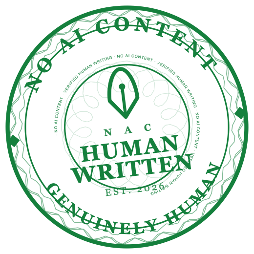
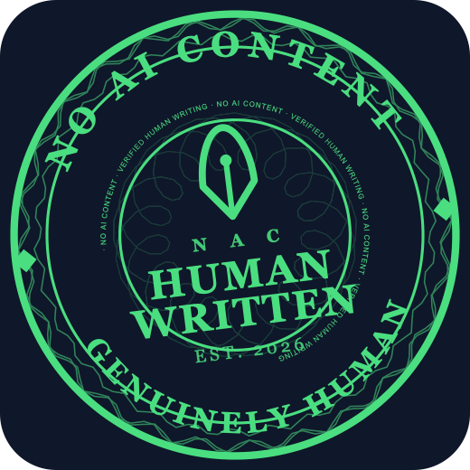
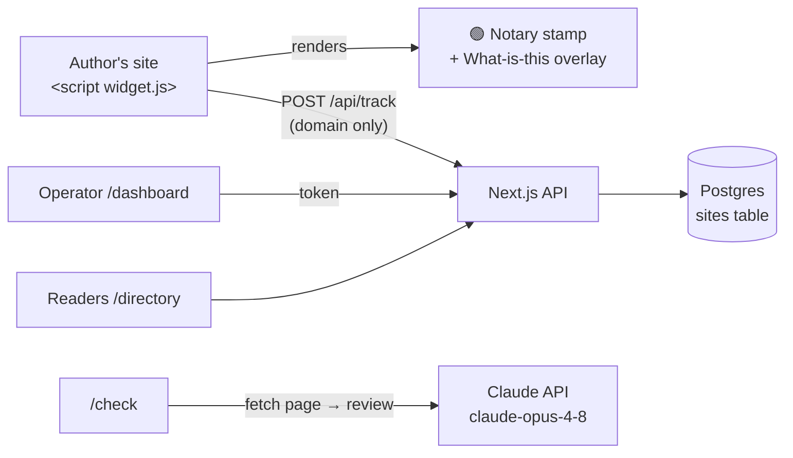

<div align="center">


# ✒︎ NAC — No AI Content

### The human‑written badge for the open web.

**NAC** is a free, open‑source **notary‑style stamp** that lets authors publicly declare their work
is written by a person — with AI used only to *refine*, never to *generate*.
Paste one line of code, and join a public directory of humans who still write by hand.

🔗 **[nac.imswarnil.com](https://nac.imswarnil.com)**

<br/>

[](./LICENSE)
[](https://nextjs.org/)
[](https://www.typescriptlang.org/)
[](https://neon.tech/)
[](https://vercel.com/new)
[](#-contributing)

<br/>

**[Live demo](https://nac.imswarnil.com) · [Add your site](#-quick-start) · [Who qualifies](#-what-counts-as-human-written) · [The directory](https://nac.imswarnil.com/directory)**

</div>

---

## ✨ Why

> I miss the old web — blogs where a human actually thought and wrote. Using AI to sharpen a
> sentence or pressure‑test an idea is fine. Publishing a soulless, end‑to‑end AI‑generated post
> as your own is not. **This badge is a small, honest signal that a person is still behind the words.**

This isn't anti‑AI. It's **pro‑human**.

---

## 🖼️ The stamp

A modern take on a **notary seal** — with real security‑print detailing (guilloché line‑work, a
microprint ring, and an engraved rosette) so it's distinctive and hard to casually copy. It
**animates onto the page** when it loads.

<div align="center">
<table>
<tr>
<td align="center"><br/><sub><b>Light</b></sub></td>
<td align="center"><br/><sub><b>Dark</b></sub></td>
</tr>
</table>
</div>

### Three styles, one signal

| Style | `data-style` | Best for |
| --- | --- | --- |
| 🟢 **Notary stamp** | `stamp` (default) | Sidebars — the full circular seal |
| ▭ **Banner** | `banner` | Footers / about pages — a horizontal card |
| ● **Compact pill** | `compact` | Inline / bylines — a tiny rounded pill |

---

## 🚀 Quick start

### 1. Run locally

```bash
git clone https://github.com/imswarnil/No-AI-Content.git nac && cd no-ai-content
npm install
cp .env.example .env      # fill in the values below
npm run dev               # → http://localhost:3000
```

### 2. Environment variables

| Variable | Required | What it is |
| --- | :---: | --- |
| `DATABASE_URL` | ✅ | Postgres connection string. Free at [neon.tech](https://neon.tech). The `sites` table is auto‑created. |
| `ADMIN_TOKEN` | ✅ | A long random secret. Gates the `/dashboard` usage view. |
| `NEXT_PUBLIC_SITE_URL` | — | Your public URL, for SEO (canonical, sitemap, Open Graph, JSON‑LD). |
| `ANTHROPIC_API_KEY` | — | Only for the `/check` human‑ness review. Get one at [console.anthropic.com](https://console.anthropic.com). |

### 3. Deploy to Vercel (free)

1. Push to GitHub → import the repo at [vercel.com](https://vercel.com/new).
2. Add a **Postgres** database (Vercel Storage, or a Neon string).
3. Set the env vars above in **Project → Settings → Environment Variables**.
4. **Deploy.** Your stamp is served from `https://nac.imswarnil.com/widget.js`.

---

## 🔌 Embed it

Authors customize the badge on your homepage and copy a one‑line snippet:

```html
<script
  src="https://nac.imswarnil.com/widget.js"
  data-author="Jane Doe"
  data-message="Written by a human. AI is used only to refine ideas — never to generate."
  data-style="stamp"
  data-theme="light"
  data-region="India"
  data-category="Personal"
  async
></script>
```

### Widget options (`data-*`)

| Attribute | Default | Description |
| --- | --- | --- |
| `data-author` | — | Name curved onto the stamp (`BY …`). |
| `data-message` | *"Written by a human…"* | Text for the banner/compact styles. |
| `data-style` | `stamp` | `stamp` · `banner` · `compact`. |
| `data-theme` | `light` | `light` · `dark`. |
| `data-ink` | green | Any CSS color — e.g. `#1e3a8a` for classic notary navy. |
| `data-size` | `156` | Stamp width in px. |
| `data-region` / `data-category` | — | Powers the public directory filters. |
| `data-link` | `/directory` | Where the badge links when clicked. |

Every badge also renders a **"What is this?"** control that answers **inside the widget** — no
modal. Clicking it replays the seal (the guilloché rings redraw stroke‑by‑stroke, the stamp
*thumps* like a real seal, the rosette and microprint ring slowly counter‑rotate) while an
explainer card slides open underneath: a manifesto types out and an "AI‑GENERATED" chip is
struck through.

---

## ✅ What counts as human‑written

The rule of thumb: **if a reader deleted the AI's contribution, your post should still exist.**

| ✅ Allowed | 🚫 Disqualifies |
| --- | --- |
| Spelling & grammar fixes | Full articles generated from a prompt |
| Rephrasing your **own** sentences | AI writes, you lightly edit |
| Pressure‑testing your ideas | Auto‑generated SEO / listicles |
| Summarizing sources you verify | Ghost‑written by AI, published as yours |
| Translating your writing | No human idea behind it |

## 🔍 The detector — our own engine

**`/check`** is a free **AI content detector** built from scratch (`lib/detect.ts`) — no
third‑party API needed. Paste text or a URL and it returns a **transparent, signal‑based
AI‑likeness score (0–100)** with every signal, weight and flagged phrase shown:

| Signal | What it measures |
| --- | --- |
| AI cliché phrases | "in today's fast‑paced world", "let's dive in", … |
| LLM‑favored vocabulary | "delve", "tapestry", "leverage", "seamless", … |
| Formal transitions | "moreover", "furthermore", "consequently", … |
| Sentence‑length burstiness | Humans vary rhythm; LLMs write uniformly |
| Personal voice & specifics | First person, concrete numbers |
| Contractions | Humans write "don't"; formal AI expands it |
| Filler / intensifiers | "very", "crucial", "comprehensive", … |
| Em‑dashes & semicolons | The famous LLM "—" habit |
| Sentence‑opener variety | "The… The… This… This…" reads templated |

Everything is tunable data — the weights and word lists live at the top of `lib/detect.ts`.
The exact **flagged phrases** are listed so writers know what to rewrite, and an optional
**Claude second opinion** gives qualitative feedback. Handy URLs like `/detector`,
`/ai-content-detector` and `/ai-checker` all redirect to it.

> ⚠️ **Honest by design:** reliable AI‑content detection is not possible — detectors routinely
> mislabel real human writing. `/check` gives **qualitative guidance to help you improve**, never a
> verdict on you as a person.

---

## 🗺️ Pages & API

| Route | What it does |
| --- | --- |
| `/` | Landing + live badge builder + animated story modal (with text‑to‑speech). |
| `/directory` | Public roll of human‑written sites — **sidebar checkbox filters** (category/region with counts), instant search, and rich cards (favicon, fetched site title & description). |
| `/eligibility` | The allowed / not‑allowed checklist. |
| `/check` | The AI content detector (own engine) + optional Claude second opinion. |
| `/detector` | SEO alias → redirects to `/check` (also `/ai-content-detector`, `/ai-checker`). |
| `/dashboard` | Private operator view (token‑gated): domains, loads, activity. |
| `POST /api/track` | Records a domain‑only badge load (no cookies, no visitor data). |
| `POST /api/detect` | Runs the in‑house detection engine on text or a URL. |
| `GET /api/directory` | Public list of embedding sites (domain, author, region, category, title, description). |
| `GET /api/sites` | Admin list (token‑gated). |
| `POST /api/analyze` | Runs the Claude human‑ness review. |

---

## 🏗️ Architecture



**Privacy model:** only the embedding **domain + timestamp + count** is stored. No IPs, no
cookies, no visitor tracking — fitting the honest‑content ethos.

---

## 🧱 Tech stack

- **Next.js 14** (App Router) · **React 18** · **TypeScript**
- **Postgres** via `@neondatabase/serverless`
- **Claude** (`@anthropic-ai/sdk`, `claude-opus-4-8`) for the human‑ness review
- Dependency‑free vanilla‑JS widget (inline SVG, Shadow‑DOM overlay, Web Speech API)
- SEO: metadata, Open Graph, `sitemap.xml`, `robots.txt`, JSON‑LD (`SoftwareApplication`)

## 📁 Structure

```
app/
  page.tsx            # landing + builder + story modal
  StoryModal.tsx      # animated slides + text-to-speech
  directory/          # public roll (search + region/category filters)
  eligibility/        # the rules checklist
  check/              # AI content detector UI (+ FAQ JSON-LD for SEO)
  dashboard/          # operator analytics
  api/{track,sites,directory,detect,analyze}/route.ts
  layout.tsx          # SEO metadata + JSON-LD
  icon.svg            # favicon (the seal)
lib/detect.ts         # the in-house AI-likeness engine (tunable signals)
lib/db.ts             # Neon Postgres + schema
public/widget.js      # the embeddable stamp (self-contained)
docs/                 # README assets
```

---

## 🧭 Roadmap

- [ ] Dynamic Open Graph share image (the stamp, per author)
- [ ] Signed / tamper‑evident stamps + a public `/verify` page
- [ ] Author accounts & API keys (verified badges)
- [ ] Email/webhook alerts when a new site embeds
- [ ] `stamp.svg` / `stamp.png` image endpoint (for Substack/Medium, which block `<script>`)

## 🤝 Contributing

PRs welcome. Open an issue to discuss substantial changes first. Run `npm run build` before
submitting.

## 📄 License

[MIT](./LICENSE) © Swarnil Singh

<div align="center"><sub>Built for humans who still write by hand. 🌱</sub></div>
