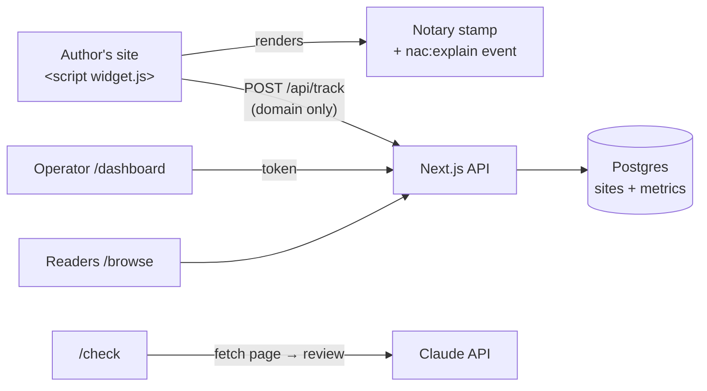

<div align="center">


# NAC — No AI Content

### The human‑written badge for the open web.

**NAC** is a free, open‑source **notary‑style stamp** that lets authors publicly declare their work
is written by a person — with AI used only to *refine*, never to *generate*.
Paste one line of code, and join a public roll of humans who still write by hand.

🔗 **[nac.imswarnil.com](https://nac.imswarnil.com)**

<br/>

[](./LICENSE)
[](https://nextjs.org/)
[](https://www.typescriptlang.org/)
[](https://neon.tech/)
[](https://vercel.com/new)
[](#-contributing)

<br/>

**[Live demo](https://nac.imswarnil.com) · [Add your site](#-quick-start) · [Who qualifies](#-what-counts-as-humanwritten) · [Browse the roll](https://nac.imswarnil.com/browse)**

</div>

---

## ✨ Why

> I miss the old web — blogs where a human actually thought and wrote. Using AI to sharpen a
> sentence or pressure‑test an idea is fine. Publishing a soulless, end‑to‑end AI‑generated post
> as your own is not. **This badge is a small, honest signal that a person is still behind the words.**

This isn't anti‑AI. It's **pro‑human**.

---

## 🖼️ The stamp

A modern take on a **notary seal** — with real security‑print detailing (guilloché line‑work, a
microprint ring, and an engraved rosette) so it's distinctive and hard to casually copy. It
**animates onto the page** when it loads: the rings draw themselves stroke‑by‑stroke, then the
whole seal presses in like a real stamp.

<div align="center">
<table>
<tr>
<td align="center"><br/><sub><b>Light</b></sub></td>
<td align="center"><br/><sub><b>Dark</b></sub></td>
</tr>
</table>
</div>

### Nine styles, one signal

Pick whichever fits where your words live — all are generated as inline SVG, so they stay sharp
at any size and carry no image files.

| Style | `data-style` | Best for |
| --- | --- | --- |
| **Notary stamp** | `stamp` *(default)* | Sidebars — the full circular seal |
| **Wax seal** | `wax` | A pressed, molten‑edge mark |
| **Passport visa** | `passport` | "Admitted to the open web" |
| **Postmark** | `postmark` | Hand‑delivered writing |
| **Prize ribbon** | `ribbon` | 100% human, award‑style |
| **Certificate** | `certificate` | Serial‑numbered declaration |
| **Typewriter byline** | `typewriter` | A quiet mono signature |
| **Banner** | `banner` | Footers / about pages |
| **Compact pill** | `compact` | Inline / bylines |

---

## 🚀 Quick start

### 1. Run locally

```bash
git clone https://github.com/imswarnil/No-AI-Content.git nac && cd nac
npm install
cp .env.example .env      # fill in the values below
npm run dev               # → http://localhost:3000
```

### 2. Environment variables

| Variable | Required | What it is |
| --- | :---: | --- |
| `DATABASE_URL` | ✅ | Postgres connection string. Free at [neon.tech](https://neon.tech). Tables are auto‑created. |
| `ADMIN_TOKEN` | ✅ | A long random secret. Gates the `/dashboard` usage view. |
| `NEXT_PUBLIC_SITE_URL` | — | Your public URL, for SEO (canonical, sitemap, Open Graph, JSON‑LD). |
| `ANTHROPIC_API_KEY` | — | Only for the optional `/check` second opinion. Get one at [console.anthropic.com](https://console.anthropic.com). |

### 3. Deploy to Vercel (free)

1. Push to GitHub → import the repo at [vercel.com](https://vercel.com/new).
2. Add a **Postgres** database (Vercel Storage, or a Neon string).
3. Set the env vars above in **Project → Settings → Environment Variables**.
4. **Deploy.** Your stamp is served from `https://your-domain/widget.js`.

---

## 🔌 Embed it

Authors customize the badge on the homepage and copy a one‑line snippet:

```html
<script
  src="https://nac.imswarnil.com/widget.js"
  data-author="Jane Doe"
  data-message="Written by a human. AI is used only to refine ideas — never to generate."
  data-style="stamp"
  data-theme="light"
  data-region="India"
  data-category="Personal"
  async
></script>
```

### Widget options (`data-*`)

| Attribute | Default | Description |
| --- | --- | --- |
| `data-author` | — | Name curved onto the stamp (`BY …`). |
| `data-message` | *"Written by a human…"* | Text for the banner/compact styles. |
| `data-style` | `stamp` | Any of the nine styles above. |
| `data-theme` | `light` | `light` · `dark`. |
| `data-ink` | seal green | Any CSS color — e.g. `#1e3a8a` for classic notary navy. |
| `data-size` | `156` | Stamp width in px. |
| `data-region` / `data-category` | — | Powers the public browse filters. |
| `data-link` | `/browse` | Where the badge links when clicked. |

### The "What is this?" button

Every badge (except `compact`) renders a small **"What is this?"** control so your readers can
find out what the seal means without leaving your page unexplained.

It is deliberately **not** a second copy of the story. The button fires a cancelable
`nac:explain` event on `window`:

- **On nac.imswarnil.com** the page handles it and opens the 16:9 scene player in place.
- **Anywhere else** nothing handles it, so the widget opens the story on the NAC site
  (`/?story=1`) in a new tab.

That keeps the embed small — the whole widget is ~21 KB, dependency‑free, one file — and means
the explainer only has to be maintained in one place. If you want to handle it yourself:

```js
window.addEventListener("nac:explain", (e) => {
  e.preventDefault();     // the widget stands down
  openYourOwnExplainer(); // …and you take over
});
```

---

## ✅ What counts as human‑written

The rule of thumb: **if a reader deleted the AI's contribution, your post should still exist.**

| ✅ Allowed | 🚫 Disqualifies |
| --- | --- |
| Spelling & grammar fixes | Full articles generated from a prompt |
| Rephrasing your **own** sentences | AI writes, you lightly edit |
| Pressure‑testing your ideas | Auto‑generated SEO / listicles |
| Summarizing sources you verify | Ghost‑written by AI, published as yours |
| Translating your writing | No human idea behind it |

---

## 🔍 The detector — our own engine

**`/check`** is a free **AI content detector** built from scratch (`lib/detect.ts`) — no
third‑party API needed. Paste text or a URL and it returns a **transparent, signal‑based
AI‑likeness score (0–100)** with every signal, weight and flagged phrase shown:

| Signal | What it measures |
| --- | --- |
| AI cliché phrases | "in today's fast‑paced world", "let's dive in", … |
| LLM‑favored vocabulary | "delve", "tapestry", "leverage", "seamless", … |
| Formal transitions | "moreover", "furthermore", "consequently", … |
| Sentence‑length burstiness | Humans vary rhythm; LLMs write uniformly |
| Personal voice & specifics | First person, concrete numbers |
| Contractions | Humans write "don't"; formal AI expands it |
| Filler / intensifiers | "very", "crucial", "comprehensive", … |
| Em‑dashes & semicolons | The famous LLM "—" habit |
| Sentence‑opener variety | "The… The… This… This…" reads templated |

Everything is tunable data — the weights and word lists live at the top of `lib/detect.ts`.
The exact **flagged phrases** are listed so writers know what to rewrite, an optional
**second opinion** (Claude API) gives qualitative feedback, and the page links out to
independent detectors so you can watch them disagree. Handy URLs like `/detector`,
`/ai-content-detector` and `/ai-checker` all redirect to it.

> ⚠️ **Honest by design:** reliable AI‑content detection is not possible — detectors routinely
> mislabel real human writing. `/check` gives **qualitative guidance to help you improve**, never a
> verdict on you as a person.

---

## 🗺️ Pages & API

| Route | What it does |
| --- | --- |
| `/` | Split hero, live badge builder, the 16:9 story player, the pulse, and share grid. |
| `/browse` | Public roll of human‑written sites — sidebar checkbox filters (category/region with counts), instant search, rich cards (favicon, fetched title & description). **Listings are live‑verified**: a site appears only while the widget is actually found on its homepage (re‑checked daily) or its badge pinged in the last 7 days — remove the widget and the listing disappears. |
| `/manifesto` | The long‑form "why this exists". |
| `/eligibility` | The allowed / not‑allowed checklist. |
| `/check` | The AI content detector (own engine) + optional second opinion. |
| `/detector` | SEO alias → redirects to `/check` (also `/ai-content-detector`, `/ai-checker`). |
| `/directory` | Permanent 301 → `/browse` (the page's old URL; old links still work). |
| `/dashboard` | Private operator view (token‑gated): domains, loads, activity. |
| `POST /api/track` | Records a domain‑only badge load (no cookies, no visitor data). |
| `POST /api/detect` | Runs the in‑house detection engine on text or a URL. |
| `POST /api/pulse` | The honest counters — page visits and the one‑question poll. |
| `GET /api/directory` | Public list of embedding sites. |
| `GET /api/sites` | Admin list (token‑gated). |
| `POST /api/analyze` | Runs the optional human‑ness review. |

---

## 🏗️ Architecture


```mermaid
flowchart LR
    A["Author's site<br/>&lt;script widget.js&gt;"] -->|renders| B["Notary stamp<br/>+ nac:explain event"]
    A -->|"POST /api/track<br/>(domain only)"| C["Next.js API"]
    C --> D[("Postgres<br/>sites + metrics")]
    E["Operator /dashboard"] -->|"token"| C
    F["Readers /browse"] --> C
    G["/check"] -->|"fetch page → review"| H["Claude API"]
```

**Privacy model:** only the embedding **domain + timestamp + count** is stored. No IPs, no
cookies, no visitor tracking. Visit counts and poll votes are remembered by *your browser*
(`sessionStorage` / `localStorage`), never by us — the goal is a truthful vibe, not analytics
of people.

---

## 🧰 Built with

<div align="center">

[](https://nextjs.org/)
[](https://react.dev/)
[](https://www.typescriptlang.org/)
[](https://neon.tech/)
[](https://vercel.com/)
[](#-design)

</div>

| Tool | Where it's used |
| --- | --- |
| **Next.js 14** (App Router) + **React 18** + **TypeScript** | The site, the builder, and every API route |
| **Neon Postgres** (`@neondatabase/serverless`) | The `sites` and `metrics` tables — serverless‑friendly, no connection pool to babysit |
| **Claude API** (`@anthropic-ai/sdk`) | The optional `/check` second opinion — constructive feedback, never a verdict |
| **Hand-rolled CSS** (`app/base.css`) | Tokens, type, motion, dark mode — no framework, no runtime, no build step |
| **Geist · Geist Mono** | One voice for everything; the mono keeps the "typed by a human" texture |
| **Vanilla JS widget** | `public/widget.js` — inline SVG, zero dependencies, ~21 KB |
| **Web Speech API** | The story player narrates itself — no service, no API key |
| **Vercel** | Hosting + deploys |

---

## 🎨 Design

The CSS is hand‑rolled and token‑first — no framework, no utility classes, no build step beyond
Next's. Three layers, and they only ever talk downward:

```
app/base.css        tokens + reset + the three primitives (.btn, .card, .chip)
app/nac-theme.css   the "Ink & Seal" brand layer — overrides ~20 semantic tokens
app/globals.css     NAC components — consumes tokens only, never raw color
```

Because components say `var(--accent)` and never `green`, the whole site changes clothes by
editing one small file. Which is why:

- **Dark mode is free** — the roles change, the components don't know. The nav's toggle just
  stamps `data-theme` on `<html>`; absent a choice, the OS decides.
- **One accent, rationed** — the page is near‑monochrome so the seal green carries all the meaning.
- **Icons are code** — `app/components/icons.tsx` is one stroke grammar (24px grid, 1.8px round
  stroke) drawing in `currentColor`, so tokens color every icon for free. No emoji, no icon font.
- **Motion argues** — the scroll figures in `app/components/ScrollArt.tsx` and the story scenes
  in `scenes.tsx` both use `pathLength="100"`, so one dash rule paces a 20px tick and a 400px
  wave identically. The machine's marks are hairline and repeating; the human's are drawn once
  and wander. Everything switches off under `prefers-reduced-motion` — showing the *finished*
  drawing, never an empty box.

---

## 📁 Structure

```
app/
  page.tsx              # split hero, builder, pulse, share
  StoryModal.tsx        # the 16:9 scene player (+ Web Speech narration)
  components/
    SiteNav.tsx         # centered nav, search, theme toggle, GitHub star
    SiteFooter.tsx
    scenes.tsx          # the five animated SVG story scenes
    ScrollArt.tsx       # scroll-triggered SVG figures for the statement bands
    icons.tsx           # the whole icon set, one stroke grammar
    Pulse.tsx           # visitor count + one-question poll
    Share.tsx           # 15 share targets, no platform SDKs
  browse/               # public roll (search + region/category filters)
  manifesto/            # the long-form why
  eligibility/          # the rules checklist
  check/                # AI content detector UI (+ FAQ JSON-LD for SEO)
  dashboard/            # operator analytics
  api/{track,sites,directory,detect,analyze,pulse}/route.ts
  layout.tsx            # SEO metadata + JSON-LD + fonts
  base.css              # tokens, reset, primitives — the foundation
  nac-theme.css         # "Ink & Seal" — token overrides only
  globals.css           # NAC components — semantic tokens only
  icon.svg              # favicon (the seal)
lib/detect.ts           # the in-house AI-likeness engine (tunable signals)
lib/db.ts               # Neon Postgres + schema
public/widget.js        # the embeddable stamp (self-contained)
docs/                   # README assets
```

See [`my-learning.md`](./my-learning.md) for the honest write‑up of what building this taught
me — from "a website is just files answering requests" to why verification had to become a
declaration instead of a verdict.

---

## 🧭 Roadmap

- [ ] Dynamic Open Graph share image (the stamp, per author)
- [ ] Signed / tamper‑evident stamps + a public `/verify` page
- [ ] Author accounts & API keys (verified badges)
- [ ] Email/webhook alerts when a new site embeds
- [ ] `stamp.svg` / `stamp.png` image endpoint (for Substack/Medium, which block `<script>`)

## 🤝 Contributing

PRs welcome. Open an issue to discuss substantial changes first. Run `npm run build` before
submitting.

## 📄 License

[MIT](./LICENSE) © Swarnil Singhai

<div align="center"><sub>Built for humans who still write by hand.</sub></div>
